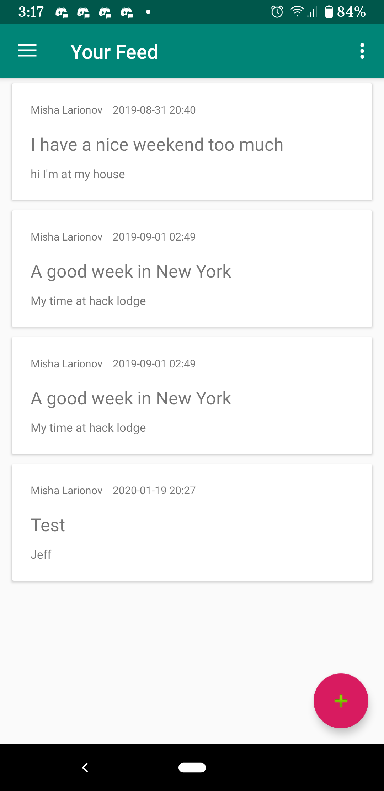
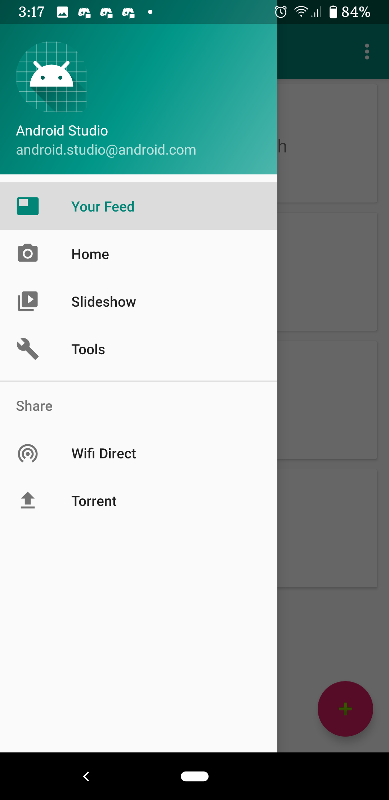
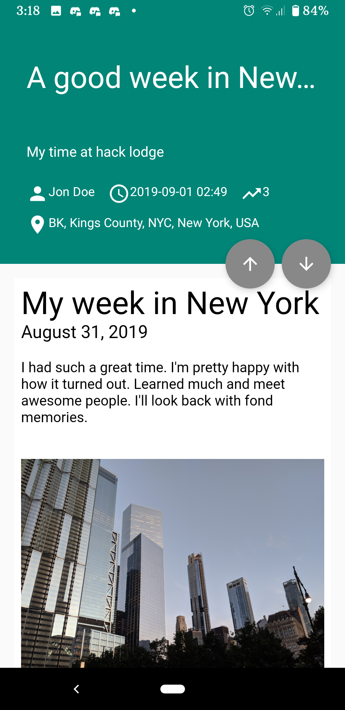
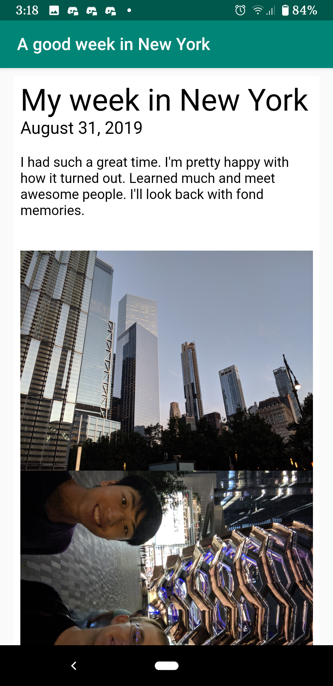
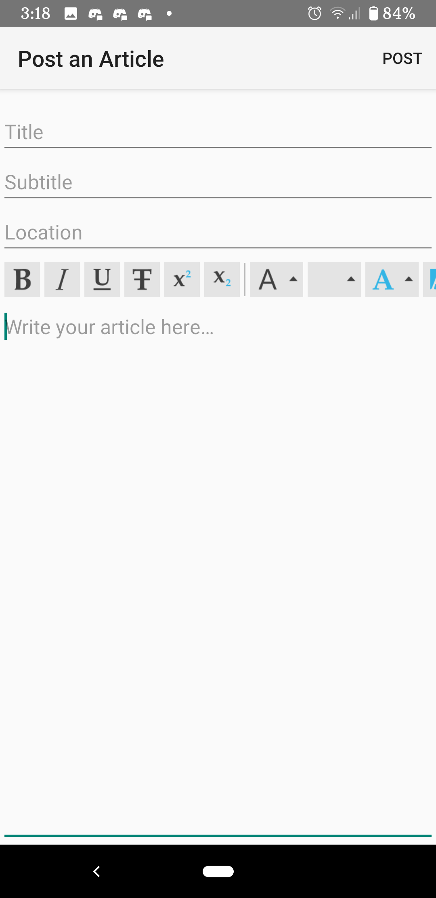
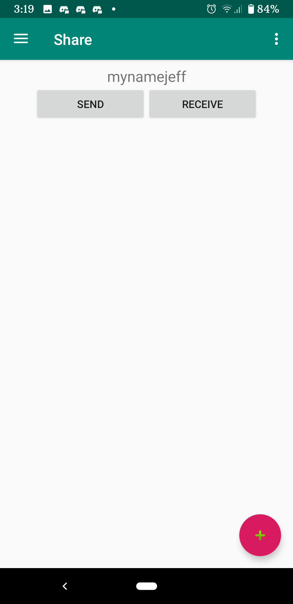

The repository for SplitNews, started at HackLodge 2019.

# About
This project has been started to address the need for a safe and decentralized medium to share news. There are concerns about the world's developments with regards to freedom of press, and this app tries to solve this issue by providing a platform for sharing news in a decentralized manner.

Built as a native Android app in Kotlin.

# UI
### Main Activity
Where you see the articles saved to your device. They are listed in card view, and you can tap on them to read them.

### Article Activity
The view for articles. The user can upvote/downvote artcles, and the content is displayed in Markdown.

### Post Editor Activity
Accessible from the Main Activity, the user is able to write their own articles here. This activity uses a pre-built Markdwon editor, and the user is able to set the key info about each article, such as Title, Subtitle, Location, etc.

### Settings Activity
Currently WIP. The goal is for enable the user to set preferences related to networking.

### Wifi Direct Fragment
Currently WIP. Searches for and display nearby clients for connecting.

# Features:
- Functional editor with reading and writing files
- Somewhat functional WiFi direct connection (didn't get to sharing files in time)
## TODOS:
- Finalize peer to peer file transfer
- Set up [IPFS]{https://docs.ipfs.io/} on Android
- Come up with app icons and post the alpha build on google play
